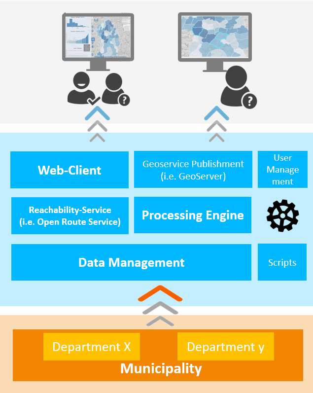

# KomMonitor Script Execution REST API
This NodeJS project is part of the [KomMonitor](http://kommonitor.de) spatial data infrastructure. As a processing component it provides a job-based computation of indicators based on georesources and other indicators within custom scripts.

**Table of Content**
<!-- TOC depthFrom:1 depthTo:6 withLinks:1 updateOnSave:0 orderedList:0 -->

- [KomMonitor Script Execution REST API](#kommonitor-script-execution-rest-api)
	- [Background Information Concerning KomMonitor Spatial Data Infrastructure](#background-information-concerning-kommonitor-spatial-data-infrastructure)
		- [Architecture Overview](#architecture-overview)
	- [Overview](#overview)
	- [Installation / Building Information](#installation-building-information)
		- [Configuration](#configuration)
			- [.env - Configure Deployment Details of other Services](#env-configure-deployment-details-of-other-services)
		- [Running the NodeJS KomMonitor Processing Engine](#running-the-nodejs-kommonitor-processing-engine)
			- [Local Manual Startup and Shutdown](#local-manual-startup-and-shutdown)
			- [Production Startup and Shutdown](#production-startup-and-shutdown)
		- [Docker](#docker)
	- [User Guide](#user-guide)
		- [Indicator Script Development](#indicator-script-development)
	- [Contribution - Developer Information](#contribution-developer-information)
		- [How to Contribute](#how-to-contribute)
		- [Branching](#branching)
	- [Third Party Dependencies](#third-party-dependencies)
	- [Contact](#contact)
	- [Credits and Contributing Organizations](#credits-and-contributing-organizations)

<!-- /TOC -->

## Background Information Concerning KomMonitor Spatial Data Infrastructure
This software is part of a spatial data infrastructure called [KomMonitor](http://kommonitor.de), which is a shortcut for German "Kommunales Monitoring" (Municipal monitoring). Funded by the *German Federal Ministry of Education and Research* municipal actors from the cities Essen and Mülheim cooperate with scientists from the Ruhr University Bochum and the Bochum University of Applied Sciences in order to create a monitoring infrastructure to support planning processes within local governments. I.e., by monitoring certain planning aspects from various topics like demography, social, environment, habitation and other, whose spatio-temporal variation and development can be measured in the form of indicators, [KomMonitor](http://kommonitor.de) may act as a *Spatial Decision Support System*. Amongst others, the following goals and key aspects are focused:
1. cross-sectional data from several topics
2. variable spatial layers (i.e. administrative layers of a city)
3. transparency with regard to indicators and how they are computed
4. cross-sectional interactive analysis and exploration
5. a complete spatial data infrastructure consisting of data management, geodata processing and indicator computation as well as data display and exploration in webclient

The project is funded from Feb 2017 - Feb 2020. The resulting software components, are published as Open-Source software to continue maintenance and development beyond the funding period.

### Architecture Overview


As a spatial decision support system, the main idea behind KomMonitor is to take (geo-)data from local authorities, import them to the *Data Management* component, process them (i.e. compute indicators based on georesurces and maybe other indicators via the *Processing Engine*; or compute waypath routing and reachability isochrones via *Reachability Service*) and finally publish, display and analyze them within a *Web-Client*.     

## Overview
This **Processig Engine API** aims to provide REST API functions to trigger and query process execution via so called jobs that shall be executed asynchronously. Hereby, it consumes various data (i.e. custom scripts including process parameters, georesources, other indicators and spatial units) from the **KomMonitor Data Management** component ([git link here](https://gitlab.fbg-hsbo.de/kommonitor/kommonitor-data-management-api)) to compute target indicators for target spatial units and target timestamps. In general, there are two types of processing operations:

1. **<u>default computation of indicators</u>**: compute a target indicator for a target timestamp on the lowest spatial unit available, automatically aggregate the results to all superior spatial units (i.e. from building blocks to quarters, to city districts, etc.) and persist the results for each spatial unit within the **KomMonitor Data Management** component. Hence this function shall be used to semi-automatically continue the timeseries for computable target indicators. This implies that all base data (base indicators and georesources used within the computation process) have available data for the target timestamp.  
2. **<u>customized indicator computation</u>**: in contrast to the **default computation of indicators** the **customized** computation only computes the result for a target indicator for a dedicated single target spatial unit and target timestamp. Furthermore, the result will not be persisted within the **KomMonitor Data Management** component, but will only be available temporarily (i.e. 2 hours). This function is meant for expert users, who want to try out a different set of process parameters to tweak the indicator computation. Indicator computation might offer certain adjustable process parameters (i.e. maximum distances for buffer/isochrone calculation, filter values, etc.) within this context. For **default computation** (continuation of timeseries) each process parameter has a *default value*. In the **customizable indicator computation** users can change the process parameters to *individual values*, compute the **customized** indicator and compare the result with the **original default computation**.

In addition, the **Processing Engine** provides a function to send a **KomMonitor** specific Feedback-E-Mail. This Feeback-Mail function is consumed by the **KomMonitor Web client** component ([git link here](https://gitlab.fbg-hsbo.de/kommonitor/kommonitor-webclient)) to send user feedback to a dedicated **KomMonitor** member.

The described REST operations are specified using [Swagger/OpenAPI v2](https://swagger.io). The corresponding ```swagger.yaml``` containing the REST API specification is located at ```api/swagger.yaml```. To inspect the REST API you may use the online [Swagger Editor](https://editor.swagger.io/) or, having access to a running instance of the **KomMonitor Data Management REST API** simply navigate to ```<pathToDeyployedInstance>/docs```, e.g. ```localhost:8086/docs```.

The service is implemented as a NodeJS server application. The custom scripts to compute indicators have to be implemented in JavaScript. Please read the section [Indicator Script Development](#indicator-script-development) to get an idea on how to write such indicator computation scripts based on a *script template* and a Node *helper module* offering several helper methods.

## Installation / Building Information
Being a NodeJS server project, installation and building of the service is as simple as calling ```npm install``` to get all the node module dependencies and run `node index.js`. This will start the service with default configuration on `localhost:8086`. Even Docker images can be acquired with ease, as described below. However, depending on your environment configuration aspects have to be adjusted first.

### Configuration
Similar to other **KomMonitor** components, some settings are required, especially to adjust connection details to other linked services to your local environment. This NodeJS app makes use of `dotenv` module, which parses a file called `.env` located at project root when starting the app to populate its properties to app components. The project already contains several examples named `.env-*`, however, the `.env` file must be updated with the correct settings, as only this file is consumed at startup.

#### .env - Configure Deployment Details of other Services
The central configuration file is located at [.env](./.env). Several important aspects must match your target environment when deploying the service. These are:

- server port:
```
# server port
PORT=8086
```
- connection to redis database (required for job handling):
```
# redis connection details
REDIS_HOST=localhost
REDIS_PORT=6379
```
- connection to KomMonitor Data Management API:
```
# KomMonitor Data Management API connection details
KOMMONITOR_DATA_MANAGEMENT_HOST=localhost
KOMMONITOR_DATA_MANAGEMENT_PORT=8085
KOMMONITOR_DATA_MANAGEMENT_BASEPATH=/management
# optional geometry simplification (a feature of Data Management API)
GEOMETRY_SIMPLIFICATION_PARAMETER_NAME=simplifyGeometries
# allowed values and meaning:
# ["original" --> no simplification; "weak" --> weak simplification,
# "medium" --> medium simplification; "strong" --> string simplification]
GEOMETRY_SIMPLIFICATION_PARAMETER_VALUE=original
```
- connection to Open Route Service instance:
```
# connection details to Open Route Service instance (required for routing and
# isochrone as well as distance matrix computation)
OPEN_ROUTE_SERVICE_URL=http://localhost:8090/openrouteservice-4.7.2
```
- required property names of ID and NAME property of KomMonitor features (**<u>MUST NOT BE CHANGED</u>**) :
```
# necessary property names internally specified by KomMonitor data structure
# DO NOT CHANGE THEM AS THIS WILL BREAK PROGRAM
FEATURE_ID_PROPERTY_NAME=ID
FEATURE_NAME_PROPERTY_NAME=NAME
```

After adjusting the configuration to your target environment, you may continue to build and run the service as described next.

### Running the NodeJS KomMonitor Processing Engine
#### Local Manual Startup and Shutdown
Make sure you have installed all node dependencies by calling `npm install`. The to locally start the server enter command `node index.js` from the project root, which will launch the app and serve it according to port setting at `localhost:<PORT>` (per default `localhost:8086`). In a browser call ``localhost:<PORT>/docs`` to inspect the REST API.
To shutdown simply hit `CTRL+c` in the terminal.

#### Production Startup and Shutdown
To launch and monitor any NodeJS app in production environment, we recommend the Node Process Manager [PM2](http://pm2.keymetrics.io/). It is a node module itself and is able to manage and monitor NodeJS application by executing simple command like `pm2 start app.js`, `pm2 restart app.js`, `pm2 stop app.js`, `pm2 delete app.js`. Via ``pm2 list`` a status monitor for running applications can be displayed. See [PM2 Quickstart Guide](http://pm2.keymetrics.io/docs/usage/quick-start/) for further information and way more details.

PM2 can even be registered as system service, so it can be automatically restarted on server restart, thus ensuring that the registered applications will be relaunched also. Depending on your host environment (e.g. ubuntu, windows, mac), the process differs. Please follow [PM2 Startup hints](http://pm2.keymetrics.io/docs/usage/startup/) for detailed information.

When installed and configured PM2, the **KomMonitor Processing Engine** can be started and monitored via `pm2 start index.js --name <app_name>` (while `<app_name>` is optional, it should be set individually, e.g. `km-processing-engine`, otherwise the application will be called `index`), executed from project root. To check application status just hit `pm2 list` and inspect the resulting dashboard for the entry with the specified `<app_name>`.

To shutdown call `pm2 stop <app_name>` in the terminal. This will stop the service. To completely remove it from PM2, call `pm2 delete <app_name>`.

### Docker
The **KomMonitor Processing Engine** can also be build and deployed as Docker image (i.e. `docker build -t processing-engine:latest .`). The project contains the associated `Dockerfile` and an exemplar `docker-compose.yml` on project root level. The Dockerfile contains a `RUN npm install` command, so necessary node dependencies will be fetched on build time.

The exemplar [docker-compose.yml](./docker-compose.yml) file specifies two services, `redis` as required redis database container and the actual `kommonitor-processing-engine` container. The latter depends on the database container and contains an `environment` section to define the required settings (connection details to other services etc. according to the [Configuration section](#configuration) mentioned above).

## User Guide
TODO

### Indicator Script Development
Complex indicators can be automatically computed by the use of custom Javascipt scripts. New scripts are based on a TEMPLATE script file. For more information about the template and the process to add/write new scripts please visit the respective documentation at [resources/README.md](/resources/README.md).

## Contribution - Developer Information
This section contains information for developers.

### How to Contribute
The technical lead of the whole [KomMonitor](http://kommonitor.de) spatial data infrastructure currently lies at the Bochum University of Applied Sciences, Department of Geodesy. We invite you to participate in the project and in the software development process. If you are interested, please contact any of the persons listed in the [Contact section](#contact):

### Branching
The `master` branch contains latest stable releases. The `develop` branch is the main development branch that will be merged into the `master` branch from time to time. Any other branch focuses certain bug fixes or feature requests.

## Third Party Dependencies
We use [license-checker](https://www.npmjs.com/package/license-checker) to gain insight about used third party libs. I.e. install globally via ```npm install -g license-checker```, navigate to root of the project and then perform ```license-checker --json --out ThirdParty.json``` to create/overwrite the respective file in JSON format.

## Contact
|    Name   |   Organization    |    Mail    |
| :-------------: |:-------------:| :-----:|
| Christian Danowski-Buhren | Bochum University of Applied Sciences | christian.danowski-buhren@hs-bochum.de |
| Andreas Wytzisk  | Bochum University of Applied Sciences | Andreas-Wytzisk@hs-bochum.de |
| Ulrike Klein | Bochum University of Applied Sciences | christian.danowski-buhren@hs-bochum.de | Ulrike.Klein@hs-bochum.de |

## Credits and Contributing Organizations
- Department of Geodesy, Bochum University of Applied Sciences
- Department for Cadastre and Geoinformation, Essen
- Department for Geodata Management, Surveying, Cadastre and Housing Promotion, Mülheim an der Ruhr
- Department of Geography, Ruhr University of Bochum
