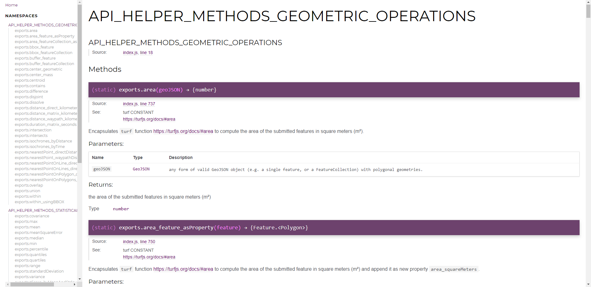
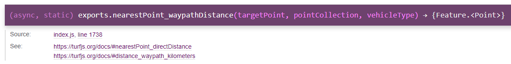
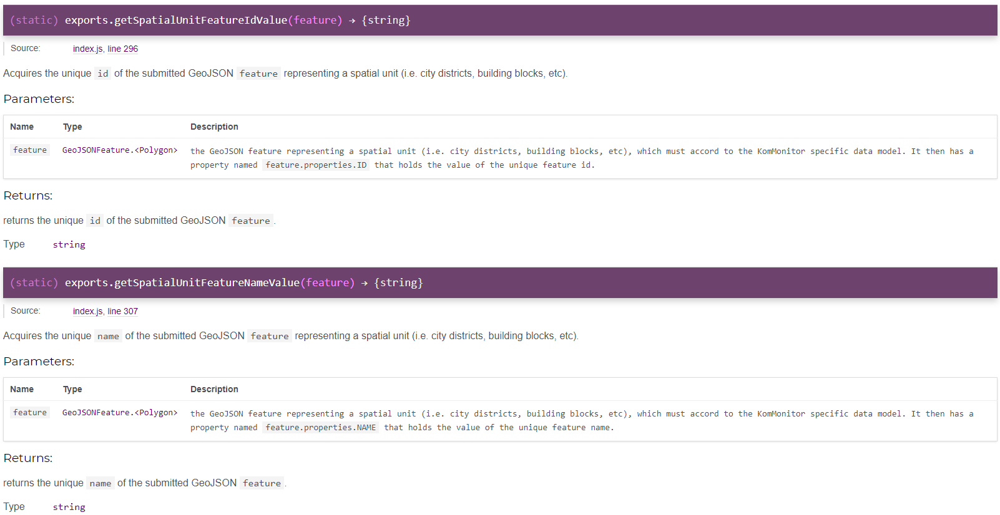

# How to write an Indicator Computation Script for KomMonitor

This guide contains helpful information on how to write and manage custom indicator computation scripts for the **KomMonitor Processing Engine**.

**Table of Content**
<!-- TOC depthFrom:1 depthTo:6 withLinks:1 updateOnSave:1 orderedList:0 -->

- [How to write an Indicator Computation Script for KomMonitor](#how-to-write-an-indicator-computation-script-for-kommonitor)
	- [Overview](#overview)
	- [Writing a custom KomMonitor Script](#writing-a-custom-kommonitor-script)
		- [The Processing Engine Helper API Node Module](#the-processing-engine-helper-api-node-module)
			- [Goals and Benefits](#goals-and-benefits)
			- [Encapsulated Libraries / Dependencies](#encapsulated-libraries-dependencies)
			- [Documented API Overview](#documented-api-overview)
		- [The TEMPLATE Script](#the-template-script)
			- [Structure and Content](#structure-and-content)
				- [CONSTANTS Section](#constants-section)
				- [METHODS Section](#methods-section)
			- [Implementing the `computeIndicator()` Method](#implementing-the-computeindicator-method)
				- [Using Base Indicators, Georesources and Process Parameters](#using-base-indicators-georesources-and-process-parameters)
					- [`KmHelper` utility methods to retrieve baseIndicators](#kmhelper-utility-methods-to-retrieve-baseindicators)
					- [`KmHelper` utility methods to retrieve georesources](#kmhelper-utility-methods-to-retrieve-georesources)
					- [`KmHelper` utility methods to retrieve process parameters](#kmhelper-utility-methods-to-retrieve-process-parameters)
				- [Using the `KmHelper` Module for various geoprocessing and statistical Operations](#using-the-kmhelper-module-for-various-geoprocessing-and-statistical-operations)
					- [Statistical Operations](#statistical-operations)
					- [Geospatial Operations](#geospatial-operations)
				- [Using `await` to actively wait for HTTP calls](#using-await-to-actively-wait-for-http-calls)
				- [Compute and set Indicator Values for `targetSpatialUnit_geoJSON` features](#compute-and-set-indicator-values-for-targetspatialunitgeojson-features)
				- [Log, log, log](#log-log-log)
			- [Automated Aggregation - Adjust Aggregation Type or overwrite Aggregation Method](#automated-aggregation-adjust-aggregation-type-or-overwrite-aggregation-method)
		- [Example Scripts](#example-scripts)
	- [Register Script within **KomMonitor Data Management** Component](#register-script-within-kommonitor-data-management-component)
	- [Running Scripts](#running-scripts)

<!-- /TOC -->

## Overview
The **KomMonitor** data infrastructure is designed to consume custom Node module scripts written in JavaScript programming language that follow a dedicated **Script TEMPLATE**. The **TEMPLATE** hereby defines special methods that need to be implemented/adjusted for each indicator. Such custom indicator computation script code can then be persisted within the **KomMonitor Data Management** component together with metadata about the associated target indicator, required base indicators, georesources and (variable) process parameters. Then, the NodeJS **KomMonitor Processing Engine** is able to integrate the script on-the-fly and call and execute the predefined methods.

To simplify matters, a **KmHelper** module is maintained and integrated into the **Script TEMPLATE**, that offers various geospatial and statistical as well as generic helper methods. So, as a script writer, you may intensively use this **KmHelper** module. Most operations (especially the geospatial operations) hereby work on *GeoJSON objects*, either by processing whole *GeoJSON FeatureCollections* or arrays of *GeoJSON Features* or by producing GeoJSON output (again either as whole *FeatureCollection* or as single *Feature* or an array of *Features*).

The following sections give details and hints on how to write custom **KomMonitor indicator computation scripts** based on the **TEMPLATE** and making use of the **KmHelper** module. First the **KmHelpere** module will be introduced in detail. Then the actual implementation of new computation scripts is focused by explaining the **TEMPLATE** structure and pointing out how to process base indicators, georesources and process parameters in order to compute the target indicator. Finally some exemplar scripts are presented that may serve as reference scripts (e.g. to apply code parts to new indicator scripts)  

## Prerequisites

The guide assumes certain **prerequisites**. Script developers should:
- have experience with **GIS tasks** in order to apply geospatial and statistical operations for indicator computation
- have **rudimentary JavaScript programming skills**
   - i.e. check out [Mozillas Guide](https://developer.mozilla.org/de/docs/Web/JavaScript/Guide) or [https://javascript.info/](https://javascript.info/) for great guides/tutorials.
	 - developers must not be JavaScript heroes, but at least *understand basic concepts and be able to learn from other examples*.
- **prevent typical JavaScript errors**. Amongst others, check out [this collection](https://www.w3schools.com/js/js_mistakes.asp) and [that atricle](https://www.toptal.com/javascript/10-most-common-javascript-mistakes)
   - depending on you development environment, try to use *linter tools* like [jshint](https://jshint.com/); i.e. using [Atom](https://atom.io/) as editor, you may install jshint as plugin to highlight code errors/warnings.
- have knowledge about the [GeoJSON](https://geojson.org/) format, especially concerning *GeoJSON FeatureCollection* and *GeoJSON Feature*. See [this tutorial](https://macwright.org/2015/03/23/geojson-second-bite.html) for basic information and GeoJSON structure.
- finally some general background information on the whole **KomMonitor Spatial Data Infrastructure** (i.e. how to interact with dedicated resources; get names and IDs of resources etc.)

Having a solid knowledge base in each of the aforementioned aspects, developers may continue on the script writing guide.

## Writing a custom KomMonitor Script  
The description is split in two parts. First the *Processing Engine Helper API Node Module* **KmHelper** module is described shortly. The actual guide then contains a detailed description of the [Template script](#the-template-script), its structure, methods to implement or overwrite and everything else required to write a script.

### The Processing Engine Helper API Node Module
This section describes the **KmHelper** module offering several geospatial and statistical as well as generic helper methods. As the **KomMonitor Processing Engine** is built as NodeJS server app, the **KmHelper** module is also written as a NodeJS module. It is not available publicly but is an implicit part of the **Processing Engine** project. Hence, the JavaScript code of the **KmHelper** module is located at [/KmHelper](./KmHelper/). The following sub sections aim to give a short overview of **KmHelper** and how to use it.

#### Goals and Benefits
The **KmHelper** module is intended to simplify the process of writing an indicator computation script. It is based on working with *GeoJSON objects* and offers several geospatial und statistical methods to process *GeoJSON Features* and, eventually compute an indicator through systematical usage of the helper methods. While it is not required to rely on **KmHelper** it is strongly recommended to make use of its predefined methods. It maximizes productivity, minifies the effort to write a new script and harmonizes the whole collection of indicator computation scripts. Moreover, improvements/adjustments to helper methods within the **KmHelper** module can thus be automatically applied to each script that utilizes the relevant methods.

#### Encapsulated Libraries / Dependencies
To perform the geospatial and statistical operations the **KmHelper** module encapsulates dedicated JavaScript libraries. As a script writing user you do not have to know anything about those internally used libraries/components as **KmHelper** encapsulates the access to those libraries/components completely within dedicated *API methods*. Nonetheless, it might be interesting to know what libraries are used under the hood.

|  Library Name  |  Description  |  Library / Component Version     |  Library Link   |
| :-------------:|:-----------: | :------------------: | :-------------: |
|  turf.js    |  mighty JavaScript library for geospatial analysis    |  5.1.6   | [https://turfjs.org/](https://turfjs.org/) <br/> [https://github.com/Turfjs/turf](https://github.com/Turfjs/turf) |
|  jStat    |   mighty JavaScript library for statistical analysis   |  1.7.1   |   [https://github.com/jstat/jstat](https://github.com/jstat/jstat)   |
|   axios   |   Promise based HTTP client for NodeJS (required to perform HTTP requests against external services like Open Route Service or Data Management API)   |  0.18.0   |  [https://github.com/axios/axios](https://github.com/axios/axios)   |
|   reference to running instance of **Open Route Service**   |   With regard to routing, isochrone or distance matrix computations, the **KmHelper** module builds and executes HTTP requests against Open Route Service   |  4.7.2   |  [https://github.com/GIScience/openrouteservice](https://github.com/GIScience/openrouteservice)   |

#### Documented API Overview
```
TODO
TODO
TODO
TODO
TODO ask Stefan, if gitlab-pages is set up and available
TODO
TODO if yes, give access to all those members that may write scripts
TODO
TODO
use most recent version,
DL git project with version control.
name some tools (TurtoiseGit, SourceTree, git CLI, ...)
keep it up to date

navigate to docs/index.html --> open it in a browser --> There you go.

if docs are missing --> hints on how to generate docs from sources.

TODO

```
To inspect the **KmHelper API** and available operations please......



Inspecting the **KmHelper** API reveals numerous alphabetically ordered methods within three so-called namespaces. The namespaces group the available operations as follows:

| Namespace | Description |
| :-------: | :-------:       |
| API_HELPER_METHODS_GEOMETRIC_OPERATIONS  |  various geospatial processing methods encapsulating dedicated methods from [turf.js](https://turfjs.org/) as well as reachability operations targeting an *Open Route Service* instance. They mainly require GeoJSON input and mainly produce GeoJSON output.|
| API_HELPER_METHODS_STATISTICAL_OPERATIONS  | various statistical processing methods encapsulating dedicated methods from [jStat](https://github.com/jstat/jstat). They mainly take arrays of numeric values as input in order to compute statistical characteristics of the submitted population array.|
| API_HELPER_METHODS_UTILITY  | various utility methods to perform special tasks related to KomMonitor specific data organization (i.e. get base indicators / georesources / process parameters; get or set indicator value for GeoJSON feature; get or set arbitrary property values from GeoJSON features), make log statements, throw errors or help with data organisation of GeoJSON objects. **It is generally recommended to make use of these utility methods rather than to modify data objects manually in order to ensure proper interaction with them as well as correct property settings** |

You will notice that each available API method is prefixed with `exports.`. This is a NodeJS specific structure and means that the Node module makes all those methods prefixed with `exports.` available publicly, while other methods not marked with that prefix are internal private methods. When using the module, the prefix is not required. I.e.

```
const KmHelper = require("kmhelper");

// call log method as an example
// no "exports." prefix is required
KmHelper.log("This is an exemplar log statement");
```

### The TEMPLATE Script
This section contains a detailed introduction to the **Script TEMPLATE**, which must be followed when writing custom indicator computation scripts for **KomMonitor**. The **Script TEMPLATE** defines predefined methods (i.e. `computeIndicator()`, `aggregateIndicator()`) as well as other adjustable `constants` that users must implement. Only by retaining the **TEMPLATE's** structure the successful processing of the script can be facilitated (of course programming errors or unexpected input might still lead to runtime errors).

The presentation of the script writing process continues as follows. First the general [Structure and Content](#structure-and-content) of the **TEMPLATE** are presented. Then the central and most important `computeIndicator()` method, that must be implemented for a new indicator, is attended in section [Implementing the `computeIndicator()` Method](#implementing-the-computeindicator-method). Moreover, details about how to extract computation resources (i.e. *base indicators*, *georesources*, *process parameters*), compute and set indicator timeseries values for the target date as well as how to use the `KmHelper` module are given. Finally hints on the adjustment of the automated aggregation of an indicator to superior spatial units are presented in section [Automated Aggregation - Adjust Aggregation Type or overwrite Aggregation Method](#automated-aggregation-adjust-aggregation-type-or-overwrite-aggregation-method).

#### Structure and Content
The **Script TEMPLATE** is quiet straightforward and well documented. It is located at [./kommonitor-node-module_TEMPLATE.js](./kommonitor-node-module_TEMPLATE.js). This section describes the general structure of the **TEMPLATE** and highlights sections where script developers must adjust constant values or implement/overwrite methods to compute a new indicator. In general the **Script TEMPLATE** starts with a section defining relevant **constants**, followed by the **method** section consisting of the `computeIndicator()`, `aggregateIndicator()` and `disaggregateIndicator()` method (the latter is currently not used within the **KomMonitor spatial data infrastructure**) as well as two pre-implemented aggregation helper methods. Details are given in the subsequent sections.

##### CONSTANTS Section
Predefined **constants** are:

```
/**
* Module that contains various helper methods (spatial GIS functions and statistical functions)
* to simplify script writing
*/
const KmHelper = require("kmhelper");


//////////////////////////////////////////////////////////////////////////////////////////////////////////////////////////////////////////////////////////////
// CONSTANTS DEFINITION                                                                                                                                     //
// here you may specify custom CONSTANTS used within the script.                                                                                            //                                            //                               //
//////////////////////////////////////////////////////////////////////////////////////////////////////////////////////////////////////////////////////////////

/**
* This constant specifies allowed values to determine how the aggregation process will deal with indicator values.
* I.e. "SUM" will compute the sum of all affected features, while "AVERAGE" will compute the average of all affected features.
* Note that these values must not be changed by users!
* @type {Array.<string>}
* @memberof CONSTANTS
* @constant
*/
const aggregationTypeEnum = ["SUM", "AVERAGE"];

/**
* via the setting constant {@linkcode aggregationType} the user can decide how the aggregation process will deal with indicator values.
* Any value of {@linkcode aggregationTypeEnum} can be used. If set to an unknown type, then "AVERAGE" is taken as fallback option
* @type {string}
* @memberof CONSTANTS
* @constant
*/
const aggregationType = "AVERAGE";

```

The first constant `const KmHelper = require("kmhelper");` is necessary to make use of the `KmHelper` API offering various helper methods as described in [The Processing Engine Helper API Node Module](#the-processing-engine-helper-api-node-module) (i.e. `KmHelper.area(geoJSONFeature);`). There are only two additional constants that have an impact on the pre-implemented generic `aggregateIndicator()` method. In detail, `const aggregationTypeEnum = ["SUM", "AVERAGE"]` lists allowed values to tweak automated aggregation, while `const aggregationType = "AVERAGE"` specifies the aggregation type that shall be applied when calling the pre-implemented `aggregateIndicator()` method. Via this constant script developers define if the **SUM** or **AVERAGE** of indicator values of features of an inferior spatial unit shall be computed for the associated superior spatial unit features. Per default, or if an unknown value is set, **AVERAGE** is used. More details about tweaking the automated indicator aggregation are described in [Automated Aggregation - Adjust Aggregation Type or overwrite Aggregation Method](#automated-aggregation-adjust-aggregation-type-or-overwrite-aggregation-method).

##### METHODS Section

In total, there are three target methods `computeIndicator()`, `aggregateIndicator()` and `disaggregateIndicator()` that script developers must take care of, when implementing a script to compute a new indicator. **Note that the exact naming and method parameter constellation is required and must not be changed**, otherwise the script handling within the surrounding **Processing Engine** cannot be guaranteed. However, currently the `disaggregateIndicator()` method is not used and can remain empty. From the remaining two methods the `aggregateIndicator()` method contains a generic pre-implemented approach, as described in detail in section [Automated Aggregation - Adjust Aggregation Type or overwrite Aggregation Method](#automated-aggregation-adjust-aggregation-type-or-overwrite-aggregation-method). This must only be overwritten in special cases. Hence only the `computeIndicator()` method definitely requires a new implementation for each new indicator. Nonethelesse, all three methods including their method parameter descriptions are presented in this section.

**computeIndicator()**

```
/**
* This method computes the indicator for the specified point in time and target spatial unit. To do this, necessary base indicators and/or georesources as well as variable process properties are defined
* as method parameters that can be used within the method body.
*
* NOTE: The function is async, so users may make use of keyword "await" to wait for results of other async helper API methods.
* (This is necessary when users want to wait for asynchronous method execution such as external API calls in a synchronous program)
*
* @param {string} targetDate - string representing the target date for which the indicator shall be computed, following the pattern {@linkcode YYYY-MM-DD}, e.g. {@linkcode 2018-01-01}
* @param {FeatureCollection<Polygon>} targetSpatialUnit_geoJSON - string target spatial unit as GeoJSON FeatureCollection object.
* @param {map.<string, FeatureCollection<Polygon>>} baseIndicatorsMap - Map containing all indicators, wheres key='meaningful name or id of the indicator' and value='indicator as GeoJSON object' (it contains duplicate entries, one for the indicator name and one for the indicator id)
* @param {map.<string, FeatureCollection<Polygon|LineString|Point>>} georesourcesMap - Map containing all georesources, wheres key='meaningful name or id of the georesource' and value='georesource as GeoJSON object' (they are used to execute geometric/toptologic computations) (it contains duplicate entries, one for the georesource name and one for the georesource id)
* @param {Array.<Object.<string, (string|number|boolean)>>} processParameters - an array containing objects representing variable additional process parameters that are required to perform the indicator computation.
* Each entry has properties Object.name and Object.value for name and value of the parameter.
* @returns {FeatureCollection<Polygon>} the computed indicator for submitted {@linkcode targetSpatialUnit_geoJSON} features as GeoJSON FeatureCollection
* @memberof METHODS_TO_IMPLEMENT_OR_OVERWRITE
* @function
*/
async function computeIndicator(targetDate, targetSpatialUnit_geoJSON, baseIndicatorsMap, georesourcesMap, processParameters){
  // compute indicator for targetDate and targetSpatialUnitFeatures

};
```

**aggregateIndicator()**

```
/**
* This method is used to aggregate indicators of a certain spatial unit to the features of a more high-level spatial unit (i.e. aggregate from building blocks to city districts).
* The template contains predefined aggregation logic that makes use of constant {@linkcode aggregationType} to decide how indicator values shall be aggregated.
* The aggrgation internally aggregates features of {@linkcode indicator_geoJSON} to features of {@linkcode targetSpatialUnit_geoJSON} by comparing their geometries.
* Each {@linkcode indicator_geoJSON} feature whose geometry lies within a certain geometry of a {@linkcode targetSpatialUnit_geoJSON} feature will be used to compute the aggregated indicator values.
* The within comparison is executed by method {@linkcode within_usingBBOX}.
* @param {string} targetDate - string representing the target date for which the indicator shall be computed, following the pattern {@linkcode YYYY-MM-DD}, e.g. {@linkcode 2018-01-01}
* @param {FeatureCollection<Polygon>} targetSpatialUnit_geoJSON - string target spatial unit features of the target spatial unit, for which the indicator shall be aggregated to as GeoJSON FeatureCollection
* @param {FeatureCollection<Polygon>} indicator_geoJSON - GeoJSON features containing the indicator values for a spatial unit that can be aggregated to the features of parameter targetSpatialUnit_geoJSON
* @see aggregationType
* @see within_usingBBOX
* @returns {FeatureCollection<Polygon>} the features of {@linkcode targetSpatialUnit_geoJSON} which contain the aggregated indicator values as GeoJSON FeatureCollection.
* @memberof METHODS_TO_IMPLEMENT_OR_OVERWRITE
* @function
*/
function aggregateIndicator(targetDate, targetSpatialUnit_geoJSON, indicator_geoJSON){
  // aggregate indicator
  // content left out here ...
  // ...
};
```

**disaggregateIndicator()**

```
/**
* This method is used to disaggregate indicators of a certain spatial unit to the features of a more low-level spatial unit (i.e. disaggregate from city districts to building blocks).
* @todo CURRENTLY THIS METHOD IS NOT USED WITHIN KOMMONITOR PROJECT: THUS IT CONTAINS NO IMPLEMENTATION YET!
* @param {string} targetDate - string representing the target date for which the indicator shall be computed, following the pattern {@linkcode YYYY-MM-DD}, e.g. {@linkcode 2018-01-01}
* @param {FeatureCollection<Polygon>} targetSpatialUnit_geoJSON - string target spatial unit features of the target spatial unit, for which the indicator shall be disaggregated to as GeoJSON FeatureCollection
* @param {FeatureCollection<Polygon>} indicator_geoJSON - GeoJSON features containing the indicator values for a spatial unit that can be disaggregated to the features of parameter targetSpatialUnit_geoJSON
* @returns {FeatureCollection<Polygon>} the features of {@linkcode targetSpatialUnit_geoJSON} which contain the disaggregated indicator values as GeoJSON FeatureCollection.
* @memberof METHODS_TO_IMPLEMENT_OR_OVERWRITE
* @function
*/
function disaggregateIndicator(targetDate, targetSpatialUnit_geoJSON, indicator_geoJSON){
  // disaggregate indicator
};
```

For each method the submitted method parameters are automatically build and assembled by the **Processing Engine**. The meaning of each parameter should be clear by reading the method comments.

#### Implementing the `computeIndicator()` Method
When it comes to implementing the **Script TEMPLATE** for a new indicator, the most important thing to do is to implement the required `computeIndicator()` method. The full method interface lists several submitted parameters and marks the method as `async`: `async function computeIndicator(targetDate, targetSpatialUnit_geoJSON, baseIndicatorsMap, georesourcesMap, processParameters)`

The main goal hereby is, to modify the indicator timeseries of each GeoJSON feature from `targetSpatialUnit_geoJSON` (which represent the features for the target spatial unit) for the submitted `targetDate`, taking the submitted process resources `baseIndicatorsMap`, `georesourcesMap` and `processParameters` into account. Eventually, the modifed `targetSpatialUnit_geoJSON` should be returned;

While the method parameters contain required computation resources for the target indicator, the keyword `async` marks the method as an asynchronous function. It is a JavaScript specific notation, and wraps the methods result within a JavaScript specific [Promise](https://developer.mozilla.org/de/docs/Web/JavaScript/Reference/Global_Objects/Promise). As a script developer you still may simply return the result (the modified `targetSpatialUnit_geoJSON`) as usual. The executing **Processing Engine** takes care of dealing with the Promise-based response of the method. Nonetheless, it is important to mark the `computeIndicator()` method as `async` as this will allow the usage of another keyword `await` within the method. The keyword `await` commands the program execution to actively wait for the complete execution of other asynchronous methods and is necessary especially when performing HTTP calls to external services. More details as well as an example can be found in the section [Using `await` to actively wait for HTTP calls](#using-await-to-actively-wait-for-http-calls).

The following subsections contain recommendations on how to use process parameters and the `KmHelper` API to modify the time series of the features of `targetSpatialUnit_geoJSON`.

##### Using Base Indicators, Georesources and Process Parameters
In general at least one process resource from the three categories `baseIndicatorsMap`, `georesourcesMap` or  `processParameters` is required to compute an indicator. I.e., an indicator may be computed through statistical analysis of one or more **base indicators**, or by geospatial analysis/processing considering one or more **georesources** or both in combination. Furthermore, **process parameters** such as, *weight*, *radius*, *maximum distance*, *...* might be necessary during the computation of indicator values. While `processParameters` is a simple array of JavaScript objects with properties `object.name` and `object.value` to store proces parameters, the aforementioned method variables `baseIndicatorsMap` and `georesourcesMap` are Javascript [Map](https://developer.mozilla.org/de/docs/Web/JavaScript/Reference/Global_Objects/Map) objects that either are empty or contains entries for each relevant resource. Each entry is represented by a **Key-Value-Pair** consisting of *Key=name* and *Value=value*. The **KomMonitor** infrastructure hereby specifies two dedicated **Key-Value-Pairs** per resource, one using the *meaningful name* as *Key* and one using the *unique resource ID* within the **KomMonitor Data Management** component as *Key*. Hence, the corresponding *Map* object contains two entries for each resource that can be accessed either by the *resource name* or the *resource ID*.

**Note, in general it is recommended to retrieve process resources via their <u>unique ID</u> as the name of a resource might change over time whereas the ID remains the same as long as the resource is not deleted completely. <u>A changing name thus might break a prior script and requires modification of associated scripts.</u>**

While in theory, script developers might directly access the map or array objects to retrieve information (i.e. via name `var myGeoresource = georesourcesMap.get("myGeoresourceName");`), the `KmHelper` API offers utility methods for that purpose:

###### `KmHelper` utility methods to retrieve baseIndicators


Example:
```
// lets assume there is a base indicator called "Birth Rate" with Id "1234-5678-9876-5432"

// recommended retrieval of baseIndicator --> via ID
var myBaseIndicator_asGeoJSONFeatureCollection = KmHelper.getBaseIndicatorById("1234-5678-9876-5432", baseIndicatorsMap);

// possible but error prone retrieval of baseIndicator --> via name
// name might change over time breaking the script!
var myBaseIndicator_asGeoJSONFeatureCollection = KmHelper.getBaseIndicatorByName("Birth Rate", baseIndicatorsMap);

// myBaseIndicator_asGeoJSONFeatureCollection is a GeoJSON FeatureCollection containing all
// features as GeoJSON features in array myBaseIndicator_asGeoJSONFeatureCollection.features
```

###### `KmHelper` utility methods to retrieve georesources


Example:
```
// lets assume there is a georesource called "Streets" with Id "1234-5678-9876-5432"

// recommended retrieval of georesource --> via ID
var myGeoresource_asGeoJSONFeatureCollection = KmHelper.getGeoresourceById("1234-5678-9876-5432", georesourcesMap);

// possible but error prone retrieval of georesource --> via name
// name might change over time breaking the script!
var myGeoresource_asGeoJSONFeatureCollection = KmHelper.getGeoresourceByName("Streets", georesourcesMap);

// myGeoresource_asGeoJSONFeatureCollection is a GeoJSON FeatureCollection containing all features
// as GeoJSON features in array myGeoresource_asGeoJSONFeatureCollection.features
```

###### `KmHelper` utility methods to retrieve process parameters
In contrast to *baeIndicators* and *georesources*, the *process parameters* can be of different types, i.e. `boolean`, `number`, `string`;
For each type, a dedicated utility method is offered by `KmHelper`, which retrieves the parameter from `processParameters` array and tries to parse it according to the type. It thus might throw an error, either if no parameter is available or the type parsing fails. In addition, process parameters are only accessible via their *name*.


Example:
```
// lets assume there is a numeric process parameter called "myRadius"=6
// lets assume there is a boolean process parameter called "filterHighways"=true
// lets assume there is a textual process parameter called "myAggregationType"="AVERAGE"

// retrieve numeric parameter
var myNumericParameter = KmHelper.getProcessParameterByName_asNumber("myRadius", processParameters);

// retrieve boolean parameter
var myBooleanParameter = KmHelper.getProcessParameterByName_asBoolean("filterHighways", processParameters);

// retrieve textual parameter
var myTextualParameter = KmHelper.getProcessParameterByName_asString("myAggregationType", processParameters);
```

##### Using the `KmHelper` Module for various geoprocessing and statistical Operations

The process of computing *target indicator values* for each feature of the *target spatial unit* often required spatial or statistical analyzation and operations. The complexity hereby varies greatly, from simple scenarios, where only indicator values from one **baseIndicator** must be processed, to complex scenarios, where multiple **georesources** must be spatially processed and compared to *target spatial unit features*. For the majority of wide-spread typically required statistical and geospatial operations, the `KmHelper` API offers helper methods, that mostly work with GeoJSON input for geospatial operations or value arrays (often called *populationArray*) for statistical operations. Please inspect the complete `KmHelper` API sections `API_HELPER_METHODS_GEOMETRIC_OPERATIONS` and `API_HELPER_METHODS_STATISTICAL_OPERATIONS` for a full list of supported features including API documentation on how to use them.

###### Statistical Operations
When performing statistical operations (i.e. get min/max/average value or more sophisticated z-score computation), a complete `populationArray` of relevant values must be constructed. Often, this `populationArray` shall contain all indicator values of a GeoJSON FeatureCollection of a certain target spatial unit. Instead of acquiring the array manually, `KmHelper` offers the method `getIndicatorValueArray(featureCollection, targetDate)`, which derives an array of all indicator values of the submitted GeoJSON FeatureCollection for the submitted targetDate.

Example:

```
async function computeIndicator(targetDate, targetSpatialUnit_geoJSON, baseIndicatorsMap, georesourcesMap, processParameters){
  // compute indicator for targetDate and targetSpatialUnitFeatures

  // retrieve base indicator ExampleIndicator with id "1234-5678-9876-5432"
  var myBaseIndicator_asGeoJSONFeatureCollection = KmHelper.getBaseIndicatorById("1234-5678-9876-5432", baseIndicatorsMap);

  // get indicator values array for submitted targetDate
  var populationArray = KmHelper.getIndicatorValueArray(myBaseIndicator_asGeoJSONFeatureCollection, targetDate);

  // get indicator values array for certain targetDate="2018-01-01"
  var populationArray_2018 = KmHelper.getIndicatorValueArray(myBaseIndicator_asGeoJSONFeatureCollection, "2018-01-01");

  /*
  * now use population array to compute statistical characteristics
  */

  // maximum value
  var maxValue = KmHelper.max(populationArray);

  // minimum value
  var minValue = KmHelper.min(populationArray);

  // average value
  var minValue = KmHelper.mean(populationArray);

  // median value
  var minValue = KmHelper.median(populationArray);

  // quantiles value - here use "[0.5, 0.75]" as example
  var quantiles = KmHelper.quantiles(populationArray, [0.5, 0.75]);

  // zScore value
  // interface: zScore_byPopulationArray(value, populationArray, computeSampledStandardDeviation)
  /*
  * computeSampledStandardDeviation: OPTIONAL flag. If set to true then 'sample' standard deviation is computed, which is also called the 'corrected standard deviation',
  * and is an unbiased estimator of the population standard deviation.
  * If set to false or undefined then the population standard deviation is computed, which is also the 'uncorrected standard deviation',
  * and is a biased but minimum-mean-squared-error estimator
  */
  var sampleFeature = myBaseIndicator_asGeoJSONFeatureCollection.features[0];
  var sampleValueOfInterest = KmHelper.getIndicatorValue(sampleFeature, targetDate);
  var zScoreForSampleFeature = KmHelper.zScore_byPopulationArray(sampleValueOfInterest, populationArray, false);

  // ...
};
```

###### Geospatial Operations
Geospatial operations analyse the spatial relation of two or more geospatial datasets. Typically, the GeoJSON features of the *target spatial unit* are compared (e.g. intersects, within) to other georesources while computing indicator values (e.g. count the number of photovoltaik-plants within each feature).

**Exemplar Script to compute CO2 savings through use of Photovoltaik plants**
```
async function computeIndicator(targetDate, targetSpatialUnit_geoJSON, baseIndicatorsMap, georesourcesMap, processParameters){
  // compute indicator for targetDate and targetSpatialUnitFeatures
  // retrieve required georesource "Photovoltaik Plants"
  var pvAnlagen = KmHelper.getGeoresourceById("255576bd-2a61-4c70-9e9b-d67d8f9b0c69", georesourcesMap);;

  KmHelper.log("Compute indicator for a total amount of " + targetSpatialUnit_geoJSON.features.length + " features");

  // for each feature of target spatial unit
  //    find all photovoltaik plants (as POIs) that lie within the feature
  //    and summarize the total CO2 savings with the help of a dedicated object property
  targetSpatialUnit_geoJSON.features.forEach(function(targetSpatialUnitFeature){

      var pvFeature;
      KmHelper.setIndicatorValue(targetSpatialUnitFeature, targetDate, 0);

      for (var pointIndex=0; pointIndex < pvAnlagen.features.length; pointIndex++){

        pvFeature = pvAnlagen.features[pointIndex];

          // spatial WITHIN via helper method
          if (KmHelper.within(pvFeature, targetSpatialUnitFeature)){
            // remove PV plant from array and decrement pointIndex
            // to remove current PV plant for remaining features
      			pvAnlagen.features.splice(pointIndex, 1);
            pointIndex--;

            // summarize and set indicator value via helper method
            var indicatorValue = KmHelper.getIndicatorValue(targetSpatialUnitFeature, targetDate) + Number(KmHelper.getPropertyValue(pvFeature, co2AttributeValue));
            KmHelper.setIndicatorValue(targetSpatialUnitFeature, targetDate, indicatorValue);
      		}
      }

      // divide by 1000 to transform from kilogram to tonnes through implicit knowledge of the datasource
      KmHelper.setIndicatorValue(targetSpatialUnitFeature, targetDate, KmHelper.getIndicatorValue(targetSpatialUnitFeature, targetDate) / 1000);
  });

  KmHelper.log("Computation of indicator finished");

  return targetSpatialUnit_geoJSON;
};
```
In more complex scenarios, multiple georesources have to be considered and maybe preprocessed in order to derive the target information. For instance check out the `computeIndicator()` method within the reachability-of-preliminary-schools example script [./example-scripts/kommonitor-node-module_erreichbarkeit-grundschulen-isochronen-mülheim.js](./example-scripts/kommonitor-node-module_erreichbarkeit-grundschulen-isochronen-mülheim.js). In short, the script analyses the spatial relation of preliminary schools (as points), habitation buildings and the target spatial unit features. First, reachability foot-walking isochrones for the school points for a variable maximum distance of X meters are computed. Then from the habitation buildings the centroid is computed. Finally for each feature of the target spatial unit the indicator value is calculated by identifying all habitation buildings within the feature and, furthermore, identify which of those buildings is, in addition, spatially within the reachability isochrones.

Some excerpts of the script, focusing the geospatial processing sections, are presented as follows.

**Excerpts from exemplar Script to compute Reachability of preliminary schools**

1. Retrieve georesources of habitation buildings and schools

```
// retrieve required georesources using its meaningful name
var wohngeb = KmHelper.getGeoresourceByName("Wohngebäude", georesourcesMap);
var schulen = KmHelper.getGeoresourceByName("Grundschulen", georesourcesMap);

// retrieve process parameter for maximum distance
var maxDistance = KmHelper.getProcessParameterByName_asNumber("MaxDistance", processParameters);
KmHelper.log("max distance parameter in m: " + maxDistance);

var grundschulen = schulen.features;
```

2. Compute foot-waking isochrones for preliminary schools

```
KmHelper.log("create distance isochrones for preliminary schools");

// isochrones by distance of 1000 m using foot-walking as GeoJSON feature collection
var isochrones_grundschulen = await KmHelper.isochrones_byDistance(grundschulen, "PEDESTRIAN", maxDistance, true);

```

3. Compute area for each building and reduce geometry to centroids

```
KmHelper.log("Compute area for each building as proxy for wohnfläche");
wohngeb = KmHelper.area_featureCollection_asProperty(wohngeb);

KmHelper.log("get centroids of buildings");
var wohngeb_centroids = new Array();
wohngeb.features.forEach(function(feature){
  wohngeb_centroids.push(KmHelper.center_mass(feature, feature.properties));
});
```

4. Spatially compare building centroids, isochrones and spatial unit features

```
KmHelper.log("calculating intersections between wohngeb and target spatial unit.");

// initial values for later comparison
targetSpatialUnit_geoJSON.features.forEach(function(spatialUnitFeature) {
	spatialUnitFeature.properties.wohnflTotal = 0;
	spatialUnitFeature.properties.wohnflCovered = 0;
});


var wohngebLength = wohngeb_centroids.length;
// create progress log after each 10th percent of features
var logProgressIndexSeparator = Math.round(wohngebLength / 100 * 10);
	for (var pointIndex=0; pointIndex < wohngebLength; pointIndex++){

		wohngebFeature = wohngeb_centroids[pointIndex];

    for (var featureIndex=0; featureIndex < targetSpatialUnit_geoJSON.features.length; featureIndex++){
      var spatialUnitFeat = targetSpatialUnit_geoJSON.features[featureIndex];

      if (KmHelper.within(wohngebFeature, spatialUnitFeat)){
  			// wohngeb_centroids.splice(pointIndex, 1);
        // pointIndex--;
  			spatialUnitFeat.properties.wohnflTotal += wohngebFeature.properties.area_squareMeters;

  			// for each isochrones_grundschulen feature check if wohngebFeature lies within it
  			for (var isochroneIndex = 0; isochroneIndex < isochrones_grundschulen.features.length; isochroneIndex++){

  				var isochrone_grundschule_feature = isochrones_grundschulen.features[isochroneIndex];

  				if(KmHelper.within(wohngebFeature, isochrone_grundschule_feature)){
  					// add wohnflaeche to wohnflCovered
  					spatialUnitFeat.properties.wohnflCovered += wohngebFeature.properties.area_squareMeters;;

  					break;
  				}
  			}

        break;
  		}
    }

    if(pointIndex % logProgressIndexSeparator === 0){
        KmHelper.log("PROGRESS: Compared '" + pointIndex + "' of total '" + wohngebLength + "' buildings to school isochrones.");
    }
	}

  targetSpatialUnit_geoJSON.features.forEach(function(spatialUnitFeature) {
    if(spatialUnitFeature.properties.wohnflTotal === 0){
      // no living building in this feature --> thus set value to NoData as it cannot be compared to features that have living buildings, which are not covered!
        spatialUnitFeature = KmHelper.setIndicatorValue_asNoData(spatialUnitFeature, targetDate);
    }
    else{
      var indicatorValue = spatialUnitFeature.properties.wohnflCovered / spatialUnitFeature.properties.wohnflTotal;
      spatialUnitFeature = KmHelper.setIndicatorValue(spatialUnitFeature, targetDate, indicatorValue);
    }

    // set Wohnfläche as aggregation weight
    spatialUnitFeature = KmHelper.setAggregationWeight(spatialUnitFeature, spatialUnitFeature.properties.wohnflTotal);

    // delete temporary helper properties
    delete spatialUnitFeature.properties.wohnflCovered;
    delete spatialUnitFeature.properties.wohnflTotal;
  });


  KmHelper.log("Computation of indicator finished");

  return targetSpatialUnit_geoJSON;
```

##### Using `await` to actively wait for HTTP calls
As mentioned above, the `computeIndicator()` method is an `async` function. This allows usage of the keyword `await` within the method. It may be utilized to command the program execution to actively wait until a Promise is resolved or rejected, a sometimes necessary trick in a synchronous program execution. In particular, when calling an asynchronous function (marked as `async`), then the method returns a Promise that is resolved or rejected sometime (i.e. make an HTTP call to external service, which takes time to fetch the result). However, the actual program execution would simply continue to the next statement, although the actual result of interest of the asynchronous function is still not available (because only the pending Promise was returned). Here, `await` comes to the rescue by commanding the execution to really wait until the Promise is resolved and return the actual result of interest (or fails when the Promise is rejected due to an error). See [this article](https://javascript.info/async-await) for further details good introduction into the matter.

The `KmHelper` module contains several asynchronous methods. When using any of these within the `computeIndicator()` method, you must prefix the call with the `await` keyword in order to really wait for the relevant result. In the API documentation for `KmHelper` module the respective methods are declared as follows:



The following list reveals the relevant asynchronous methods:

- `distance_waypath_kilometers(point_A, point_B, vehicleType) → {number}`
- `distance_matrix_kilometers(locations, sourceIndices, destinationIndices, vehicleType) → {object}`
- `duration_matrix_seconds(locations, sourceIndices, destinationIndices, vehicleType) → {object}`
- `isochrones_byDistance(startingPoints, vehicleType, travelDistanceInMeters, dissolve, deactivateLog, avoid_features) → {FeatureCollection.<Polygon>}`
- `isochrones_byTime(startingPoints, vehicleType, travelTimeInSeconds, customMaxSpeedInKilometersPerHour, dissolve, deactivateLog, avoid_features) → {FeatureCollection.<Polygon>}`
- `nearestPoint_waypathDistance(targetPoint, pointCollection, vehicleType) → {Feature.<Point>}`

**Example**
When computing isochrones  you must prefix the call with `await`:

```
// request with await keyword
// isochrones by distance of 1000 m using foot-walking as GeoJSON feature collection
var isochrones_grundschulen = await KmHelper.isochrones_byDistance([[7.0,51.2],[7.1, 51.3]], "PEDESTRIAN", 1000, true);

// program takes a few moments to reach this as the isochrone request takes some time but is fully resolved
KmHelper.log(isochrones_grundschulen); // isochrones_grundschulen will be GeoJSON Feature Collection
```

If you do not use `await` then the synchronous program execution continues to work with the still pending Promise:

```
// request without await keyword
// isochrones by distance of 1000 m using foot-walking as GeoJSON feature collection
var isochrones_grundschulen = KmHelper.isochrones_byDistance([[7.0,51.2],[7.1, 51.3]], "PEDESTRIAN", 1000, true);

// program continues immediately after former statement - Promise is still pending
KmHelper.log(isochrones_grundschulen); // isochrones_grundschulen will be pending Promise;

// any further call to isochrones_grundschulen will go against pending Promise
```

##### Compute and set Indicator Values for `targetSpatialUnit_geoJSON` features

When writing the script, chaining geospatial and/or statistical operations, script developers come to the point where the computed result has to be *registered* within the target spatial unit feature for the target date. In other words, the *timeseries of the respective feature must be updated with the computed indicator value for the target date*. As the **KomMonitor** data structure defines a certain pattern to store the timeseries (i.e. using the prefix `DATE_` as a feature property like `DATE_yyyy-mm-dd`; example `DATE_2018-01-01`), it is error prone to manually update the features properties with regard to timeseries modification. Instead the `KmHelper` module offers dedicated methods for **retrieval** and **modification** of indicator timeseries values. Within the `computeIndicator()` method, the method parameter `targetSpatialUnit_geoJSON` is a GeoJSON FeatureCollection comprising all target spatial unit features and their indicator timeseries. Retrieval or modification of timeseries values should be directly performed on the features of this FeatureCollection.

**Retrieval and Modification of Indicator Timeseries Values**
To retrieve an indicator timeseries value of a single feature use the `KmHelper` method `getIndicatorValue(feature, targetDate) → {number}`. To set/modify the indicator timeseries value use `KmHelper` method `setIndicatorValue(feature, targetDate, indicatorValue) → {Feature}`.



The subsequent example loops over each feature of an exemplar target spatial unit FeatureCollection. Next to the unique `featureId` and `featureName`, its indicator timeseries value for the `targetDate` is fetched and logged (if unset, the result will be `undefined`). Then we assume some modifications of the indicator value and set it as new timeseries value within the feature.  

```
async function computeIndicator(targetDate, targetSpatialUnit_geoJSON, baseIndicatorsMap, georesourcesMap, processParameters){

	// loop over each feature of the target spatial unit
  targetSpatialUnit_geoJSON.features.forEach(function(targetSpatialUnitFeature){

		var featureId = KmHelper.getSpatialUnitFeatureIdValue(targetSpatialUnitFeature);
		var featureName = KmHelper.getSpatialUnitFeatureNameValue(targetSpatialUnitFeature);

		// get the indicatorValue for the current target date
		// target date as format "yyyy-mm-dd", e.g. "2018-01-01"
    var indicatorValue = KmHelper.getIndicatorValue(targetSpatialUnitFeature, targetDate);

		KmHelper.log("old indicatorValue for feature with id: " + featureId + " and name " + featureName + " is: " + indicatorValue); // might be undefined if it was not yet set

		// modify indicatorValue
		var modifiedIndicatorValue = ...; // omitted here

		// set timeseries value
		KmHelper.setIndicatorValue(targetSpatialUnitFeature, targetDate, modifiedIndicatorValue);

		KmHelper.log("modified indicatorValue for feature with id: " + featureId + " and name " + featureName + " is: " + modifiedIndicatorValue);
  });

	// return all target spatial unit features
  return targetSpatialUnit_geoJSON;
};
```

###### NoData Values
Indicator values in general are numeric values. Often the number `0` can be used to indicate that a certain phenomenon is not present for the feature. However, in some cases `NoData` must be used instead to differentiate between features that have `0` values and features that simply cannot be compared to others (so they must be set to a `NoData` value). For such cases, the `KmHelper` module offers the methods `setIndicatorValue_asNoData(feature, targetDate) → {Feature}` to set the `NoData` value and `isNoDataValue(value) → {boolean}` to inspect weather an indicator value is the `NoData` value. It is strongly recommended to make use of these methods when dealing with `NoData` indicator time series values, as the **KomMonitor Spatial Data Infrastructure** requires the implicitly defined `NoData` encoding.

##### Log, log, log
It is generally recommended to use log statements within the code. While it is not necessary to log each and every step, a good rule of thumb is to log the inputs, important intermediate results and the final computation results as well as to describe the process of data computation. Logs are important for failure detection and to understand where and why the computation was aborted for certain input objects. Especially the output of a computation should be logged, as in JavaScript, minor programming errors or data type conflicts might lead to silent `undefined` results that are tricky to resolve without any logs.

To log something, either `console.log(text)` or `KmHelper.log(text)` can be used.

#### Automated Aggregation - Adjust Aggregation Type or overwrite Aggregation Method

describe default setting
--> aggregation by comparing the centroid of inferior spatial unit features to superior spatial unit features --> best with a picture

tweakable aggregation according to type (SUM/AVERAGE)

set aggregation weight during indicator computation within `computeIndicator()`!!!

state when and how the `aggregateIndicator()` method should be completely overwritten by script developers.

### Example Scripts

Example scripts are located at [./example-scripts](./example-scripts/). This directory contains numerous examples based on the current version of the **script TEMPLATE** and `KmHelper` API. Script developers may inspect those and copy code parts and adjust them for any new script.

## Register Script within **KomMonitor Data Management** Component
REST call, Script registration, Parameter definition and naming etc.

```
TODO
TODO
TODO
```

## Running Scripts
Currently there is no dedicated test environment to test and execute written scripts. So, currently scripts must be integrated into a running KomMonitor instance and executed there (best in a local instance, not in productive environments).

```
TODO
TODO
TODO
```

REST call, Script registration, Parameter definition and naming etc. to Processing Engine
distinguish between defaultCOmputation and CustomizableComputation and how there output will be used within data infrastructure
